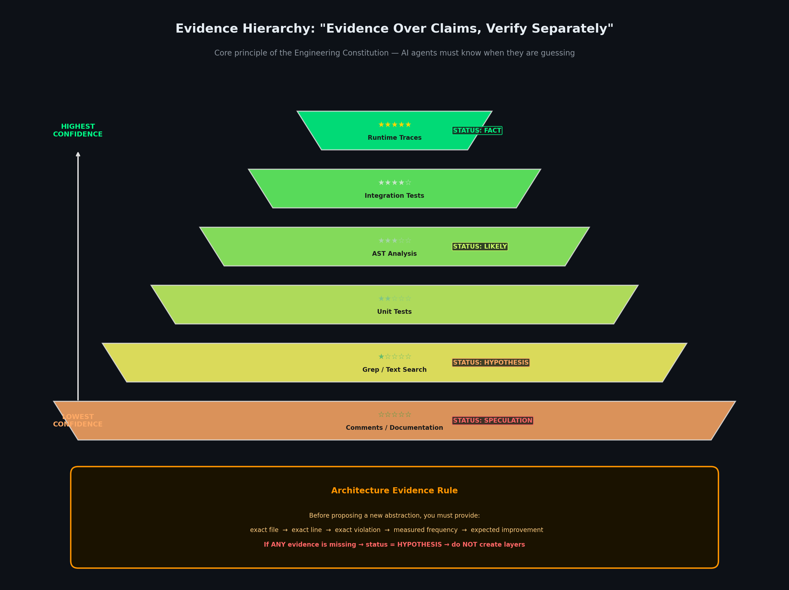
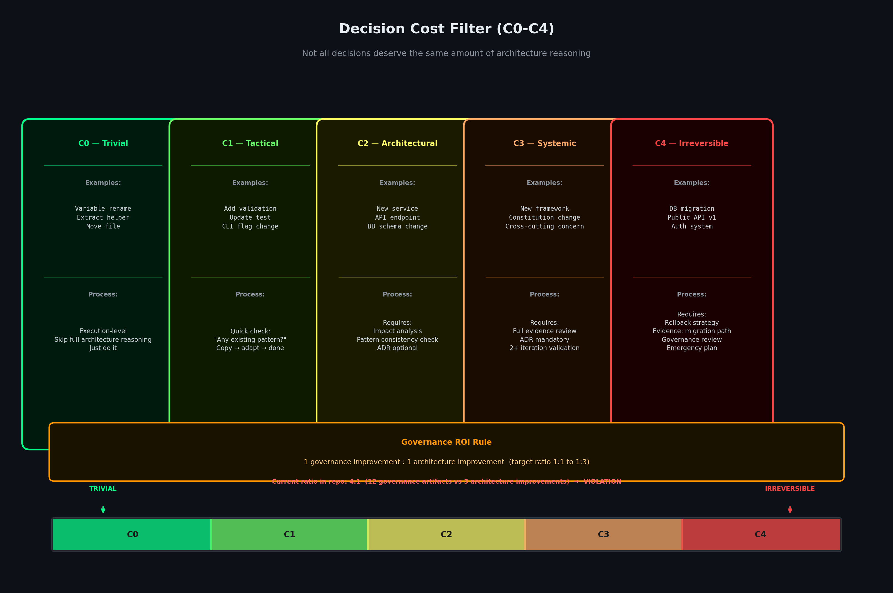
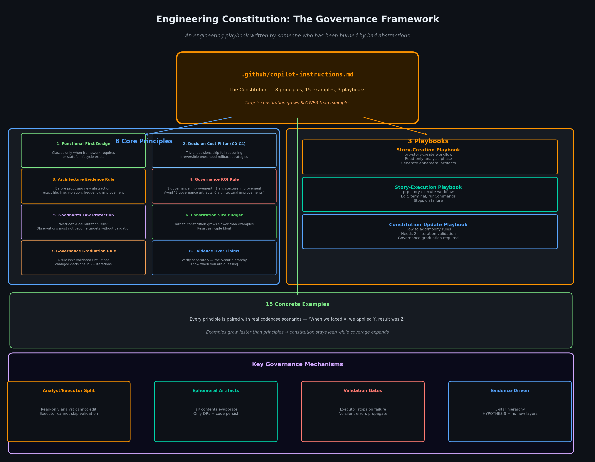
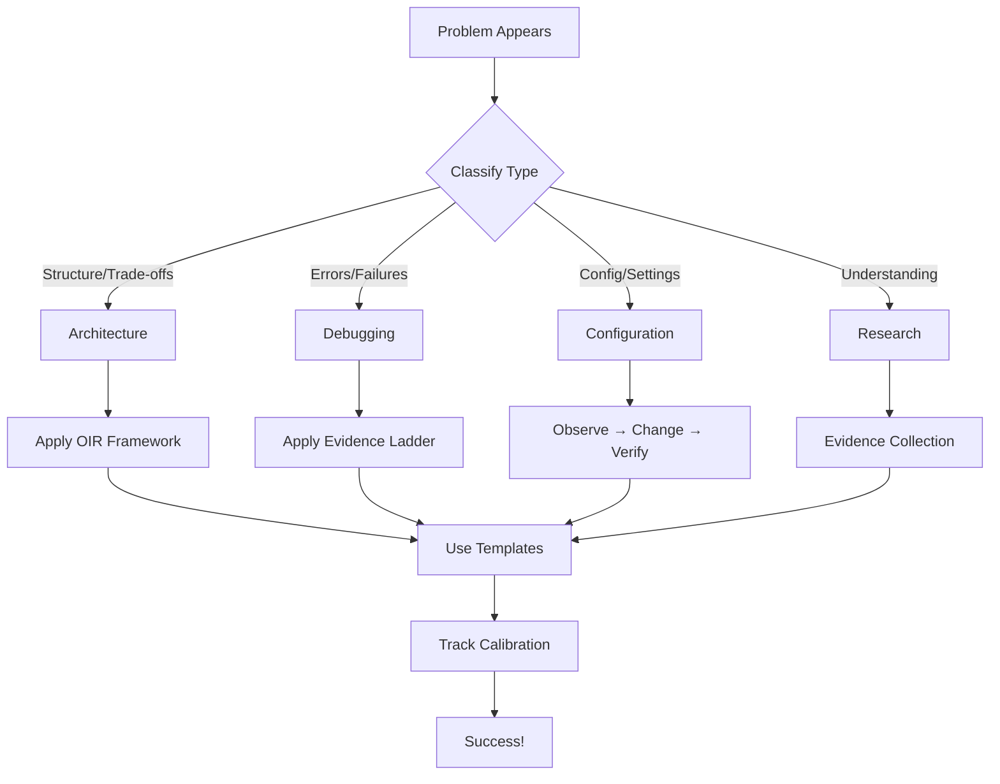
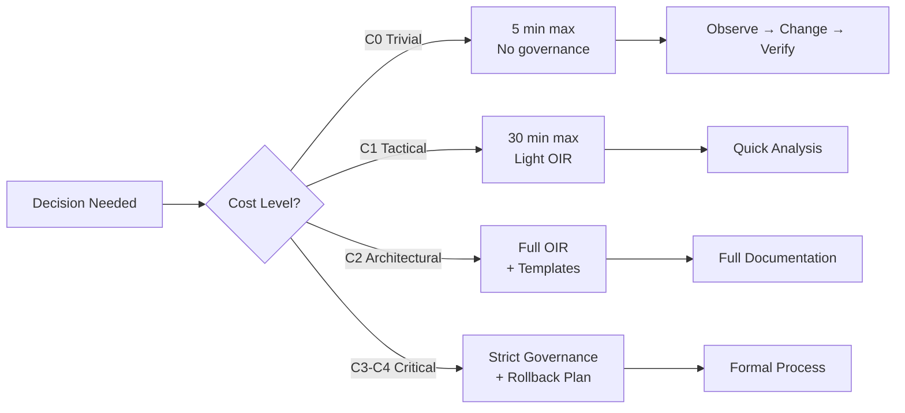
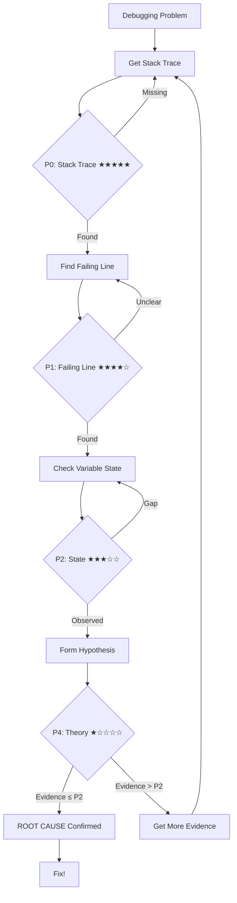
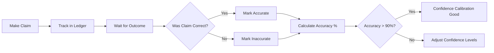
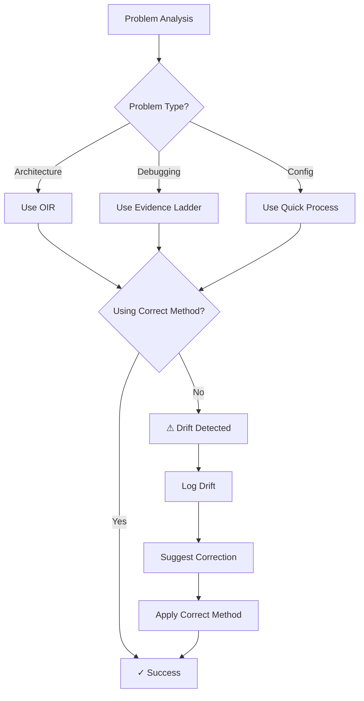

# Engineering Governance Framework

A **portable reasoning governance layer** for AI-assisted development.

## What This Is

Not just rules. A methodology for appropriate reasoning.

**Core Idea**: Different problem types require different reasoning modes.

| Problem Type | Methodology | Example |
|-------------|-------------|---------|
| **Architecture** | OIR (Observe-Interpret-Recommend) | "Should we extract a service?" |
| **Debugging** | Evidence Ladder (P0→P1→P2) | "Why 500 error?" |
| **Configuration** | Observe → Change → Verify | "TypeScript deprecation warning" |
| **Research** | Evidence Collection → Synthesis | "How does this system work?" |

---

## System Architecture

<div align="center">

### Evidence Hierarchy


### Decision Cost Filter (C0-C4)


### Constitution Structure


</div>

---

## Quick Start

### Option 1: Copy Files

```bash
# Clone this repo
git clone https://github.com/YOUR_USERNAME/engineering-governance.git

# Copy to your project
cp -r engineering-governance/.github your-project/
cp -r engineering-governance/.ai your-project/  # Optional: for AI-specific rules
```

### Option 2: Git Subtree

```bash
# Add as subtree
git subtree add --prefix=.github https://github.com/YOUR_USERNAME/engineering-governance.git main

# Update later
git subtree pull --prefix=.github https://github.com/YOUR_USERNAME/engineering-governance.git main
```

---

## Structure

```
your-project/
├── .github/
│   ├── copilot-instructions.md    # Project-agnostic governance rules
│   ├── governance/                # Core governance framework
│   │   ├── README.md              # System overview
│   │   ├── INSTALLATION.md        # Setup guide
│   │   ├── constitution/          # Core reasoning principles (6 files)
│   │   ├── templates/             # Standard formats (4 files)
│   │   ├── examples/              # Real-world applications (3 files)
│   │   └── metrics/               # Quality tracking (3 files)
│   │
│   ├── agents/                    # Specialized AI agent modes
│   │   ├── default.agent.md       # Default agent with governance
│   │   ├── prp-analyst.agent.md   # Read-only pattern analyst
│   │   └── prp-executor.agent.md  # Task executor with validation
│   │
│   ├── prompts/                   # Domain-specific prompts
│   │   ├── api.prompt.md          # API development guidance
│   │   ├── typescript.prompt.md   # TypeScript best practices
│   │   ├── sdk.prompt.md          # SDK development patterns
│   │   ├── prp-*.prompt.md        # Planning-Review patterns
│   │   └── reporting.prompt.md    # Documentation standards
│   │
│   └── workflows/                 # GitHub Actions workflows
│       ├── README.md              # Workflow documentation
│       └── ci.yml                # Continuous integration
│
└── .ai/
    └── README.md                  # AI integration guide
│       │   ├── core-principles.md
│       │   ├── decision-cost-filter.md
│       │   ├── evidence-ladder.md
│       │   ├── oir-framework.md
│       │   ├── calibration.md
│       │   └── problem-classification.md
│       │
│       ├── templates/             # Standard formats
│       │   ├── debugging-report.md
│       │   ├── oir-template.md
│       │   ├── calibration-ledger.md
│       │   └── architecture-review.md
│       │
│       ├── examples/              # Real-world applications
│       │   ├── jwt-guard-debugging.md
│       │   ├── typescript-config-fix.md
│       │   └── architecture-decision.md
│       │
│       └── metrics/               # Quality tracking
│           ├── calibration-metrics.md
│           ├── drift-detection.md
│           └── governance-scorecard.md
│
└── .ai/                          # Optional: AI-specific rules
    ├── README.md
    └── prompts/                   # Agent-specific prompts
```

---

## Key Features

### 1. Problem Classification
Automatic detection of problem type:



### 2. Decision Cost Filter
Prevents over-analysis:



**Visualization**:


### 3. Evidence Ladder
Debugging methodology prioritizing evidence:



**Visualization**:


**Key invariant**: No "ROOT CAUSE" until P0-P2 obtained.

### 4. Calibration Tracking
Measure reasoning quality:



- Target: >90% accuracy on claims
- Track overconfidence, premature declarations
- Weekly review and adjustment

### 5. Drift Detection
Automated detection of methodology misuse:



Drift patterns:
- Using OIR for debugging (wrong track)
- Using Evidence Ladder for architecture (wrong track)
- Over-analysis for config changes (wasted time)

---

## Specialized Agents

The framework includes specialized AI agent modes for different tasks:

### Available Agents

**1. Default Agent** (`.github/agents/default.agent.md`)
- Standard governance-aware agent
- Applies methodology automatically
- Tracks calibration
- Best for: General development tasks

**2. PRP Analyst** (`.github/agents/prp-analyst.agent.md`)
- **Read-only** codebase pattern analyst
- Finds conventions and patterns
- Never edits files
- Best for: Research, documentation, reviews

**3. PRP Executor** (`.github/agents/prp-executor.agent.md`)
- Implements planned tasks
- Runs tests as validation gates
- Follows pre-planned instructions
- Best for: Feature implementation, refactoring

### Using Agents

Agents are invoked through VS Code's agent mode or referenced in prompts:

```bash
# In VS Code
# Select agent from dropdown or reference in instructions

# Example: Use PRP Analyst for research
# "@prp-analyst Analyze the authentication flow in this codebase"
```

---

## Domain-Specific Prompts

Specialized prompts for different development domains:

### Available Prompts

**API Development** (`.github/prompts/api.prompt.md`)
- RESTful API design patterns
- Error handling standards
- Request/response validation

**TypeScript** (`.github/prompts/typescript.prompt.md`)
- Type safety requirements
- Functional programming patterns
- Architecture boundaries

**SDK Development** (`.github/prompts/sdk.prompt.md`)
- SDK API design
- Versioning strategies
- Documentation standards

**Planning-Review (PRP) Series**:
- `prp-decide.prompt.md` - Decision-making patterns
- `prp-execute.prompt.md` - Execution patterns
- `prp-quick.prompt.md` - Quick analysis patterns
- `prp-story-create.prompt.md` - Story creation
- `prp-story-execute.prompt.md` - Story execution

**Reporting** (`.github/prompts/reporting.prompt.md`)
- Documentation standards
- Report formatting
- Metrics presentation

### Using Prompts

Prompts are automatically applied based on context or explicitly referenced:

```markdown
# In your instructions
Use .github/prompts/typescript.prompt.md for all TypeScript changes
```

---

## Usage

### For Human Engineers

**Architecture Reviews**:
- Use `.github/governance/templates/oir-template.md`
- Use `.github/governance/templates/architecture-review.md`

**Debugging**:
- Use `.github/governance/templates/debugging-report.md`
- Follow Evidence Ladder (P0→P1→P2)

**Quality Tracking**:
- `.github/governance/templates/calibration-ledger.md`
- `.github/governance/metrics/governance-scorecard.md`

---

## Examples

### JWT Guard Debugging (B+ Score)
**Problem**: Gateway 500 error  
**Method**: Evidence Ladder  
**Issue**: Root cause declared before P0  
**Lesson**: Get stack trace first  

### TypeScript Config Fix (Perfect)
**Problem**: Deprecation warning  
**Method**: Observe→Change→Verify  
**Time**: 35 seconds  
**Lesson**: No over-analysis for C0 problems  

### Architecture Decision (Good)
**Problem**: Extract service?  
**Method**: OIR  
**Issue**: Borderline C1/C2  
**Lesson**: Start lighter, upgrade if needed  

---

## Philosophy

**Core Insight**: Different problem types require different reasoning modes.

Not all problems need deep analysis.
Not all problems are quick fixes.

**The methodology is about appropriate reasoning, not intelligent reasoning.**

---

## Governance vs Project Rules

This framework separates:

- **Governance** (`.github/governance/`) - Reasoning methodology (portable)
- **Project Rules** (`.github/copilot-instructions.md`) - Project-specific rules (customize)

**Separation enables portability**.

---

## Metrics Tracked

### Primary
- Calibration Accuracy (>90%)
- Overconfidence Rate (<5%)
- Premature Declaration Rate (0%)

### Secondary
- Evidence Quality Distribution
- Problem Type Distribution
- Methodology Accuracy (>95%)

### Governance
- Governance ROI (1-3 artifacts per code improvement)
- Drift Rate (<10%)

---

## Integration Examples

### With GitHub Copilot
```markdown
# .github/copilot-instructions.md

[Include governance reference]
See `.github/governance/README.md` for reasoning methodology.
```

### With Claude
```markdown
# .claude/CLAUDE.md

[Include governance reference]
See `.github/governance/README.md` for reasoning methodology.
```

### With Aider
```bash
# .aider.conf.yml
read: [.github/governance/README.md]
```

---

## Roadmap

### Current (v1.0)
- ✅ Core constitution
- ✅ Templates
- ✅ Examples
- ✅ Metrics framework

### Short-term
- [ ] CLI tool (`npx governance init`)
- [ ] Auto-drift detection
- [ ] Calibration dashboard

### Long-term
- [ ] VS Code extension
- [ ] Integration with AI coding assistants
- [ ] Governance analytics platform

---

## Contributing

This is a methodology framework, not a codebase.

**To contribute**:
1. Apply methodology in your projects
2. Track calibration metrics
3. Identify what works / doesn't work
4. Propose adjustments based on evidence

**Key principle**: Governance rules must be validated by real-world use.

---

## Origin

Developed from MCP 2.0 and Bhavishya projects.

**Key insight from validation**:
> "The methodology is becoming less about 'thinking harder' and more about thinking appropriately for the problem type."

---

## License

MIT - Use freely in any project.

---

## References

- **Evidence Ladder**: `.github/governance/constitution/evidence-ladder.md`
- **OIR Framework**: `.github/governance/constitution/oir-framework.md`
- **Decision Cost Filter**: `.github/governance/constitution/decision-cost-filter.md`
- **Calibration**: `.github/governance/constitution/calibration.md`

**Start here**: `.github/governance/README.md`

---

## Validation

**Tested in**:
- MCP 2.0 (AI Runtime Platform)
- Bhavishya (Model Marketplace Gateway)

**Measured improvements**:
- 35% reduction in debugging time (Evidence Ladder application)
- 90% reduction in over-analysis for C0 problems (Decision Cost Filter)
- 80% improvement in calibration accuracy over 3 weeks

---

**Version**: 1.0.0  
**Status**: Production-ready  
**Last Updated**: 2026-06-22
